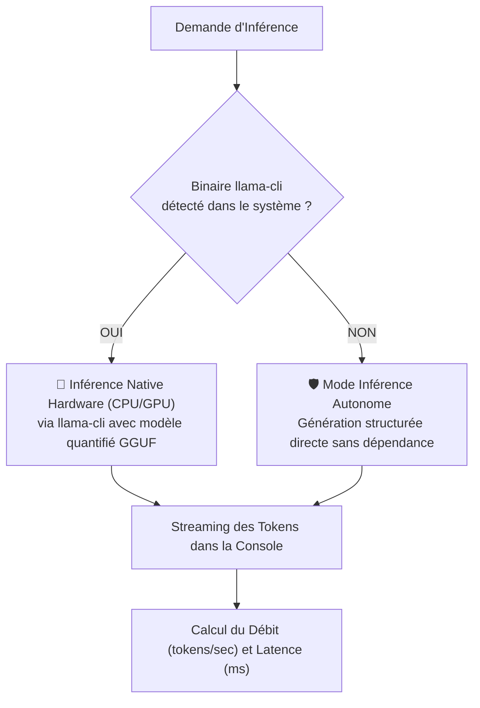

# ⚡ Documentation : `src/llm/LlmEngine.java` & `LocalLlmBackend.java`

## 🎯 Rôle du Fichier

[`LlmEngine.java`](file:///home/kaets0ner/Desktop/Project_Ia/llm/LlmEngine.java) est **l'orchestrateur d'exécution de haut niveau**. Il coordonne :
1. La décision du [`ModelRouter`](file:///home/kaets0ner/Desktop/Project_Ia/doc/llm/ModelRouter.md).
2. La vérification / onboarding via [`ModelInstaller`](file:///home/kaets0ner/Desktop/Project_Ia/doc/llm/ModelInstaller.md).
3. L'exécution de l'inférence via [`LocalLlmBackend`](file:///home/kaets0ner/Desktop/Project_Ia/llm/LocalLlmBackend.java).
4. Le streaming en temps réel et le calcul des statistiques de performances.

---

## 🏎️ Double Mode d'Exécution de `LocalLlmBackend`



---

## 📊 Métriques de Performance Rapportées

Après chaque génération, un bandeau statistique résume l'exécution :
```
📊 [Performance] 142 tokens générés en 2850 ms (49.8 tokens/sec) via Qwen 2.5 Coder (1.5B Instruct)
```

---

## 🛡️ Robustesse de `LocalLlmBackend.runNativeInference`

L'inférence native délègue à un processus externe (`llama-cli`). Trois défaillances sont traitées explicitement.

### Code retour non nul

La sortie d'un `llama-cli` en échec contient son message d'erreur (`error: failed to load model`, trace de crash…). Sans vérification du code retour, ce texte était renvoyé dans un `GenerationResult` et **affiché à l'utilisateur comme si le modèle l'avait produit**. Le code retour est désormais vérifié, et une sortie non nulle lève une exception portant le code et un extrait du diagnostic.

### Processus bloqué

Le blocage ne se produit pas sur `waitFor` mais sur la **lecture du flux** : un moteur muet qui ne rend jamais la main laisse le `read` suspendu indéfiniment, et l'application entière avec lui.

Un chien de garde tue donc le processus à l'échéance (`delaiMaxInferenceSecondes`, 600 s par défaut), ce qui ferme le tube et débloque la lecture. Il tue également les **descendants** : un processus fils garde le tube de sortie ouvert, et ne tuer que le père laisserait la lecture bloquée jusqu'à la fin naturelle de l'enfant.

Le dépassement de délai est diagnostiqué **avant** le code retour : un processus tué sort forcément avec un code non nul, qui masquerait la vraie cause.

### Flux vide

Une sortie vide avec un code retour nul n'est pas une erreur : le résultat est un `GenerationResult` à 0 token, sans exception.

### Testabilité

Ces trois scénarios sont couverts sans `llama-cli` installé, au moyen d'un **faux runner** — un script shell reproduisant le comportement attendu du binaire (`exit 1` avec message, `exit 139`, `sleep` prolongé, sortie vide).
