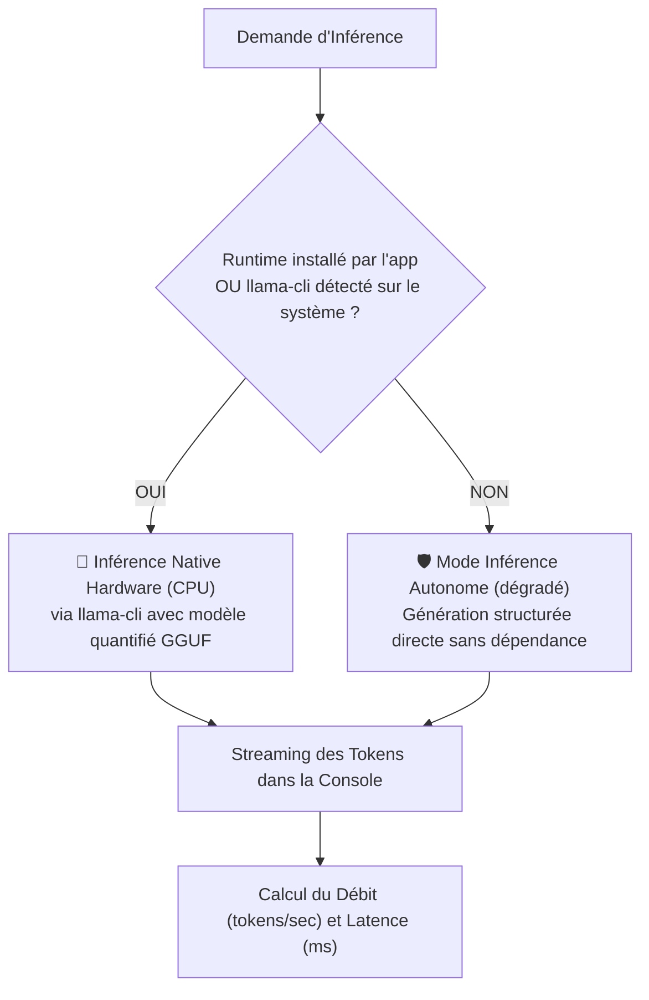

# ⚡ Documentation : `src/llm/LlmEngine.java` & `LocalLlmBackend.java`

## 🎯 Rôle du Fichier

[`LlmEngine.java`](file:///home/kaets0ner/Desktop/Project_Ia/llm/LlmEngine.java) est **l'orchestrateur d'exécution de haut niveau**. Il coordonne :
1. La décision du [`ModelRouter`](file:///home/kaets0ner/Desktop/Project_Ia/doc/llm/ModelRouter.md).
2. La vérification / onboarding du modèle via [`ModelInstaller`](file:///home/kaets0ner/Desktop/Project_Ia/doc/llm/ModelInstaller.md).
3. L'installation automatique du runtime natif via [`RuntimeInstaller`](RuntimeInstaller.md), vérifiée avant **chaque** exécution.
4. L'exécution de l'inférence via [`LocalLlmBackend`](LocalLlmBackend.md).
5. Le streaming en temps réel et le calcul des statistiques de performances.

---

## 🆕 Provisioning au Premier Lancement

Une exécution locale réelle demande **deux** éléments : les poids du modèle (`.gguf`) *et* le moteur d'inférence natif (`llama-cli`). `LlmEngine.execute` les provisionne indépendamment.

**1. Les poids du modèle.** Si le modèle sélectionné n'est pas installé, l'assistant d'onboarding demande la permission, puis `ModelInstaller.telechargerModele` récupère le fichier.

**2. Le moteur d'inférence.** La disponibilité du runtime (`LocalLlmBackend.isRuntimeAvailable`) est vérifiée **à chaque exécution, et non uniquement quand le modèle vient d'être téléchargé**. Un `.gguf` déjà présent sur le disque sans `llama-cli` faisait sinon retomber le backend sur une réponse simulée, en silence (Issue #55). S'il manque :

| État | Comportement |
|:---|:---|
| Permission déjà accordée | Installation automatique via `RuntimeInstaller.telechargerEtInstallerRuntime` |
| Pas de permission, mode interactif | `ModelInstaller.demanderPermissionRuntime` demande l'autorisation |
| Pas de permission, mode non interactif | Avertissement explicite, poursuite en mode dégradé |

Si le runtime ne peut pas être installé (plateforme non supportée, pas de connexion, refus de l'utilisateur), l'exécution se poursuit en mode dégradé (réponse simulée) avec un avertissement explicite, plutôt que d'échouer silencieusement.

### Testabilité

L'installation du runtime passe par la couture `LlmEngine.RuntimeProvisioner`, injectable via le constructeur à 5 arguments. Le constructeur à 4 arguments branche l'implémentation réelle (`RuntimeInstaller::telechargerEtInstallerRuntime`) ; les tests injectent un espion, afin qu'aucune suite TDD ne déclenche de téléchargement réseau.

---

## 🏎️ Double Mode d'Exécution de `LocalLlmBackend`



---

## 📊 Métriques de Performance Rapportées

Après chaque génération, un bandeau statistique résume l'exécution :
```
📊 [Performance] 142 tokens générés en 2850 ms (49.8 tokens/sec) via Qwen 2.5 Coder (1.5B Instruct)
```
