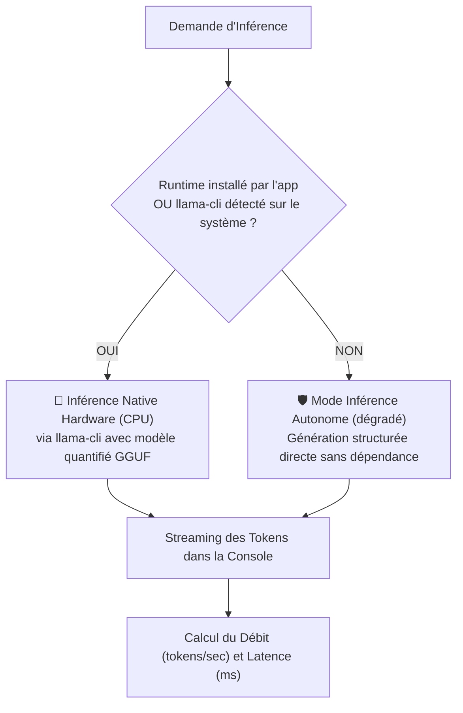

# ⚡ Documentation : `src/llm/LlmEngine.java` & `LocalLlmBackend.java`

## 🎯 Rôle du Fichier

[`LlmEngine.java`](file:///home/kaets0ner/Desktop/Project_Ia/llm/LlmEngine.java) est **l'orchestrateur d'exécution de haut niveau**. Il coordonne :
1. La décision du [`ModelRouter`](file:///home/kaets0ner/Desktop/Project_Ia/doc/llm/ModelRouter.md).
2. La vérification / onboarding du modèle via [`ModelInstaller`](file:///home/kaets0ner/Desktop/Project_Ia/doc/llm/ModelInstaller.md).
3. L'installation automatique du runtime natif via [`RuntimeInstaller`](RuntimeInstaller.md) lors de ce même premier provisioning.
4. L'exécution de l'inférence via [`LocalLlmBackend`](LocalLlmBackend.md).
5. Le streaming en temps réel et le calcul des statistiques de performances.

---

## 🆕 Provisioning au Premier Lancement

Quand le modèle sélectionné n'est pas encore installé et que l'utilisateur accorde la permission, `LlmEngine.execute` :
1. Télécharge les poids du modèle (`ModelInstaller.telechargerModele`).
2. Vérifie si un runtime natif (`llama-cli`) est déjà disponible (`LocalLlmBackend.isRuntimeAvailable`) ; sinon, télécharge et installe automatiquement le build officiel adapté à l'OS/architecture courants (`RuntimeInstaller.telechargerEtInstallerRuntime`).

Si le runtime ne peut pas être installé (plateforme non supportée, pas de connexion), l'exécution se poursuit en mode dégradé (réponse simulée) avec un avertissement explicite, plutôt que d'échouer silencieusement.

---

## 🏎️ Double Mode d'Exécution de `LocalLlmBackend`



---

## 📊 Métriques de Performance Rapportées

Après chaque génération, un bandeau statistique résume l'exécution :
```
📊 [Performance] 142 tokens générés en 2850 ms (49.8 tokens/sec) via Qwen 2.5 Coder (1.5B Instruct)
```
