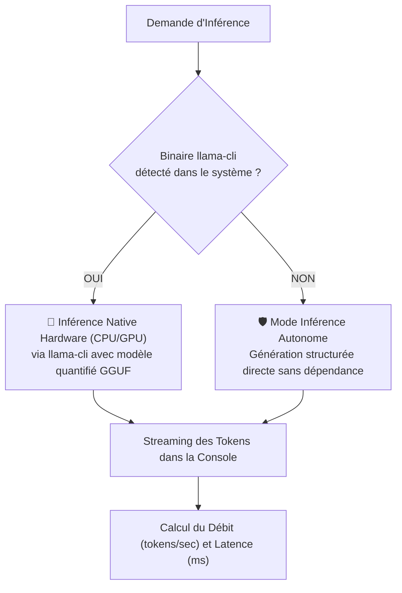

# ⚡ Documentation : `llm/LlmEngine.java` & `LocalLlmBackend.java`

## 🎯 Rôle du Fichier

[`LlmEngine.java`](file:///home/kaets0ner/Desktop/Project_Ia/llm/LlmEngine.java) est **l'orchestrateur d'exécution de haut niveau**. Il coordonne :
1. La décision du [`ModelRouter`](file:///home/kaets0ner/Desktop/Project_Ia/doc/llm/ModelRouter.md).
2. La vérification / onboarding via [`ModelInstaller`](file:///home/kaets0ner/Desktop/Project_Ia/doc/llm/ModelInstaller.md).
3. L'exécution de l'inférence via [`LocalLlmBackend`](file:///home/kaets0ner/Desktop/Project_Ia/llm/LocalLlmBackend.java).
4. Le streaming en temps réel et le calcul des statistiques de performances.

---

## 🏎️ Double Mode d'Exécution de `LocalLlmBackend`



---

## 📊 Métriques de Performance Rapportées

Après chaque génération, un bandeau statistique résume l'exécution :
```
📊 [Performance] 142 tokens générés en 2850 ms (49.8 tokens/sec) via Qwen 2.5 Coder (1.5B Instruct)
```
