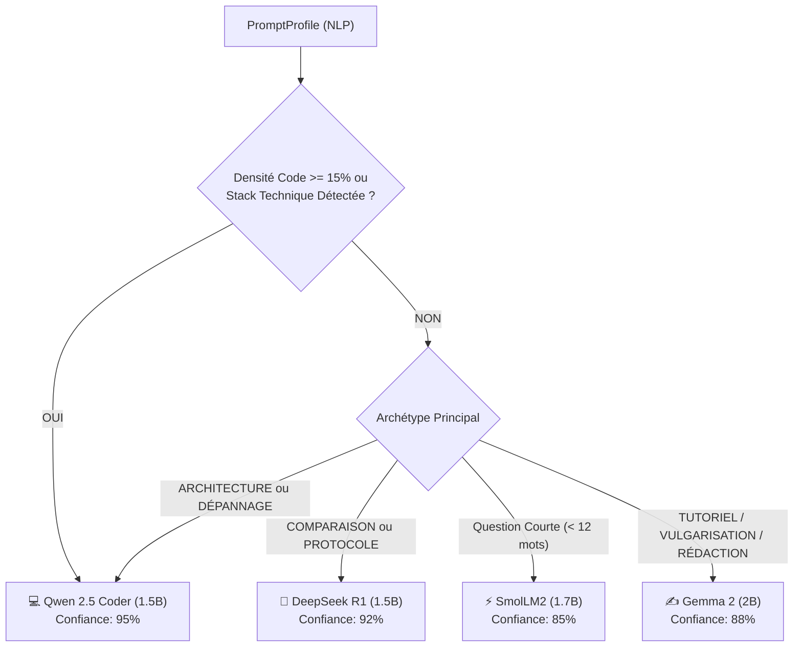

# 🧠 Documentation : `llm/ModelRouter.java`

## 🎯 Rôle du Fichier

Le composant [`ModelRouter.java`](file:///home/kaets0ner/Desktop/Project_Ia/llm/ModelRouter.java) implémente le **moteur de décision et d'aiguillage sémantique**. Il analyse la fiche d'identité du prompt ([`PromptProfile`](file:///home/kaets0ner/Desktop/Project_Ia/nlp/PromptProfile.java)) produite par le pipeline NLP et sélectionne de manière déterministe le modèle de langage léger le plus apte à traiter la demande.

---

## ⚙️ Logique Décisionnelle en Cascade

---

## 📊 Structure du Résultat (`RoutingDecision`)

Chaque décision retourne un record Java contenant :
- `selectedModel` : Le [`ModelType`](file:///home/kaets0ner/Desktop/Project_Ia/llm/ModelType.java) choisi.
- `rationale` : L'explication textuelle pédagogique affichée à l'utilisateur.
- `confidenceScore` : Le score de confiance de l'attribution (ex: `0.95`).
- `isManualOverride` : Booléen indiquant si le modèle a été imposé manuellement via `--model / -m`.
