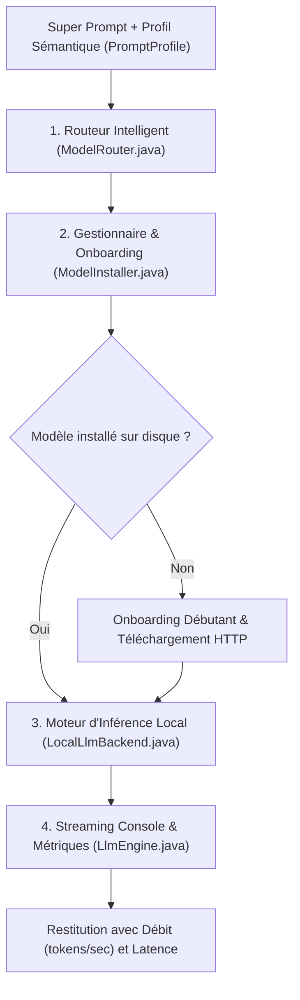

# 🔄 Documentation : Pipeline du Moteur d'Inférence LLM (`llm/pipeline.txt`)

Ce document détaille les 4 étapes du flux d'exécution locale des Small Language Models (SLMs).

---

## 🗺️ Schéma du Pipeline LLM

---

## 📋 Description des Phases

### 1. Routage Intelligent (`ModelRouter.java`)
- Analyse multi-critères : densité de code, archétype primaire, décomposition logique et longueur du texte.
- Attribution instantanée (0 ms) vers le modèle expert adapté (Qwen Coder, Gemma 2, DeepSeek R1 ou SmolLM2).

### 2. Gestion de Modèle & Onboarding (`ModelInstaller.java`)
- Vérification de la présence du fichier `.gguf` dans `models/`.
- Dialogue pédagogique au premier démarrage pour obtenir l'accord éclairé de l'utilisateur.
- Téléchargement HTTP avec barre de progression dynamique `[====>  ] 45%`.

### 3. Inférence Locale (`LocalLlmBackend.java`)
- Détection du runner matériel natif (`llama-cli`).
- Exécution de l'inférence avec contrôle de température et de taille de contexte.

### 4. Streaming & Métriques (`LlmEngine.java`)
- Diffusion des tokens en temps réel.
- Calcul de la latence totale et du débit en tokens par seconde.
